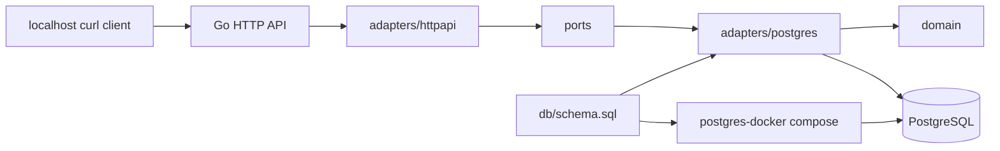

# Paisa

Paisa is being reframed as a loyalty-platform backend for companies that want to
offer customer rewards without building benefit management, member management,
reward calculation, and fulfillment infrastructure in house.

The current vertical slice now includes the backend loyalty core plus an
API-backed partner console. Legacy `partner_key` URL routes remain for local
compatibility, while new partner and cashier APIs use session/API-key scoped
authentication.

## Current Scope

- Partner creation and lookup by `partner_key`
- Partner programs and published rule versions
- Rule groups for `stack`, `max_of`, and `waterfall` earn behavior
- Member creation, member identifiers, accounts, and active program enrollment
- Partner-scoped transaction ingestion with idempotency
- Async transaction processing job
- Reward calculation from published rules only
- Refund/reversal calculation from the original transaction trace
- Insert-only ledger entries and balance snapshots
- Manual point adjustments
- Ledger-derived liability export summaries
- Partner session login and partner-scoped API keys
- Phone/email/QR member resolution for cashier workflows
- Reward catalog and reserve/capture/release redemption lifecycle
- Manual cashier transaction ingestion
- Partner locations, integration connection records, and campaign/passport records
- API-backed partner console with cashier, rewards, integrations, onboarding, and campaigns views

Deferred for now:

- Internal admin users and impersonation
- Production Square OAuth credentials and live Square transaction pulling
- Reservation timeout and earned-point expiration jobs
- Production migrations

## Architecture



## Repository Layout

```text
accts-api/
  server.go
  adapters/
    httpapi/
    postgres/
      internal/repository/
  application/
  domain/
  ports/
  api/
    requests.md
db/
  schema.sql
docs/
frontend/
  index.html
  src/
postgres-docker/
  docker-compose.yml
  setup.sh
```

`db/schema.sql` is the shared schema source. Docker mounts it into Postgres init,
and the Go API reads the same file during local startup. Override the path with
`PAISA_SCHEMA_PATH` if needed.

## Local Setup

One-command local startup for Postgres, the Go API, the frontend, and a default
local partner admin:

```bash
PAISA_POSTGRES_PASSWORD=local-dev-password ./scripts/local-up.sh --fresh
```

The `--fresh` flag clears the local Postgres Docker volume first, so the partner
starts with no programs, rules, rewards, or checkout history. The script prints
the local URLs and login credentials. Press `Ctrl-C` to stop the API and
frontend; Postgres stays running in Docker.

Start Postgres:

```bash
cd postgres-docker
export PAISA_POSTGRES_PASSWORD="<local-dev-password>"
docker compose up -d
```

To reset local data and re-run the schema init:

```bash
cd postgres-docker
export PAISA_POSTGRES_PASSWORD="<local-dev-password>"
docker compose down -v
docker compose up -d
```

Run the API:

```bash
cd accts-api
export PAISA_POSTGRES_PASSWORD="<local-dev-password>"
export PAISA_INTERNAL_ADMIN_TOKEN="local-internal-admin-token"
PAISA_SCHEMA_PATH=../db/schema.sql go run server.go
```

The API listens on `http://localhost:8080`.

Create a local partner and first partner admin before signing into the UI:

```bash
curl -X POST http://localhost:8080/internal/v1/partners/onboard \
  -H 'content-type: application/json' \
  -H 'X-Paisa-Internal-Admin-Token: local-internal-admin-token' \
  -d '{
    "partnerKey": "acme-retail",
    "partnerName": "Acme Retail",
    "adminEmail": "admin@acme-retail.test",
    "adminName": "Acme Admin",
    "adminPassword": "AcmeAdmin123"
  }'
```

Run the simple UI:

```bash
cd frontend
npm install
npm run dev
```

Open the Vite localhost URL printed by `npm run dev`. The page is an API-backed
partner-admin console that calls the backend at `http://localhost:8080`. Login
with the onboarded partner admin email/password. A partner key is now a workspace
slug, not an authentication credential.

For a full onboarding and load rehearsal, see
`docs/e2e/loyalty-onboarding-runbook.md`. The reusable runner is:

```bash
PAISA_API_BASE=http://localhost:8080 node scripts/e2e-loyalty-load.mjs
```

By default it creates 3 partners, 2 programs per partner, 1000 members, 10000
purchase transactions, and 1000 reserve/validate/capture redemptions. Override
counts with `PAISA_E2E_MEMBERS`, `PAISA_E2E_TRANSACTIONS`, and
`PAISA_E2E_REDEMPTIONS`.

## Smoke Test Localhost Clients

These examples assume `curl` and `jq` are installed. Start Postgres and the API
first, then run the whole block from the repo root.

```bash
set -euo pipefail

API="http://localhost:8080"
PARTNER_KEY="acme-demo-$(date +%s)"
CUSTOMER_ID="cust-1001"

echo "1. Health"
curl -fsS "$API/health" | jq .

echo "2. Create partner"
PARTNER=$(curl -fsS -X POST "$API/v1/partners" \
  -H "Content-Type: application/json" \
  -d "{\"partnerKey\":\"$PARTNER_KEY\",\"name\":\"Acme Demo\"}")
echo "$PARTNER" | jq .

echo "3. Create program"
PROGRAM=$(curl -fsS -X POST "$API/v1/partners/$PARTNER_KEY/programs" \
  -H "Content-Type: application/json" \
  -d '{"name":"Gold Rewards","tierCode":"gold","priority":1}')
PROGRAM_ID=$(echo "$PROGRAM" | jq -r '.id')
echo "$PROGRAM" | jq .

echo "4. Create draft rule version"
RULE_VERSION=$(curl -fsS -X POST "$API/v1/partners/$PARTNER_KEY/programs/$PROGRAM_ID/rule-versions" \
  -H "Content-Type: application/json" \
  -d '{
    "earnBasis": "eligible",
    "ruleGroups": [
      {
        "name": "Everyday earn",
        "resolutionStrategy": "max_of",
        "priority": 1,
        "rules": [
          {
            "ruleKey": "base_earn",
            "name": "Base earn",
            "ruleType": "points_per_dollar",
            "priority": 1,
            "status": "active",
            "formulaConfig": {"pointsPerDollar": 1}
          },
          {
            "ruleKey": "grocery_bonus",
            "name": "Grocery bonus",
            "ruleType": "points_per_dollar",
            "priority": 2,
            "status": "active",
            "eligibilityConfig": {"categories": ["grocery"]},
            "formulaConfig": {"pointsPerDollar": 5},
            "limits": [
              {"scope": "member", "period": "calendar_month", "maxPoints": 300}
            ]
          }
        ]
      }
    ]
  }')
RULE_VERSION_ID=$(echo "$RULE_VERSION" | jq -r '.id')
echo "$RULE_VERSION" | jq .

echo "5. Publish rule version"
curl -fsS -X POST "$API/v1/partners/$PARTNER_KEY/programs/$PROGRAM_ID/rule-versions/$RULE_VERSION_ID/publish" | jq .

echo "6. Create enrolled member"
MEMBER=$(curl -fsS -X POST "$API/v1/partners/$PARTNER_KEY/members" \
  -H "Content-Type: application/json" \
  -d "{
    \"externalCustomerId\": \"$CUSTOMER_ID\",
    \"programId\": \"$PROGRAM_ID\",
    \"identifiers\": [{\"type\":\"email\",\"value\":\"member-1001@example.invalid\"}]
  }")
MEMBER_ID=$(echo "$MEMBER" | jq -r '.member.id')
echo "$MEMBER" | jq .

echo "7. Ingest purchase"
PURCHASE_BODY="{
  \"externalTransactionId\": \"txn-1001\",
  \"externalCustomerId\": \"$CUSTOMER_ID\",
  \"type\": \"purchase\",
  \"currency\": \"USD\",
  \"subtotalMinor\": 10000,
  \"taxMinor\": 600,
  \"totalMinor\": 10600,
  \"eligibleMinor\": 10000,
  \"occurredAt\": \"2026-07-24T12:00:00Z\",
  \"lineItems\": [
    {
      \"externalLineId\": \"line-1\",
      \"sku\": \"sku-grocery\",
      \"category\": \"grocery\",
      \"quantity\": 1,
      \"subtotalMinor\": 10000,
      \"taxMinor\": 600,
      \"totalMinor\": 10600,
      \"eligibleMinor\": 10000
    }
  ]
}"
PURCHASE=$(curl -fsS -X POST "$API/v1/partners/$PARTNER_KEY/ingest/transactions" \
  -H "Content-Type: application/json" \
  -d "$PURCHASE_BODY")
PURCHASE_ID=$(echo "$PURCHASE" | jq -r '.id')
echo "$PURCHASE" | jq .

echo "8. Retry same purchase; should return same transaction event"
curl -fsS -X POST "$API/v1/partners/$PARTNER_KEY/ingest/transactions" \
  -H "Content-Type: application/json" \
  -d "$PURCHASE_BODY" | jq .

echo "9. Same external transaction id with changed payload; should return 409"
CONFLICT_STATUS=$(curl -sS -o /tmp/paisa-conflict.json -w "%{http_code}" \
  -X POST "$API/v1/partners/$PARTNER_KEY/ingest/transactions" \
  -H "Content-Type: application/json" \
  -d "{
    \"externalTransactionId\": \"txn-1001\",
    \"externalCustomerId\": \"$CUSTOMER_ID\",
    \"type\": \"purchase\",
    \"currency\": \"USD\",
    \"eligibleMinor\": 20000
  }")
echo "status=$CONFLICT_STATUS"
cat /tmp/paisa-conflict.json | jq .

echo "10. Process accepted transaction events"
curl -fsS -X POST "$API/v1/jobs/process-transaction-events" | jq .

echo "11. Inspect purchase calculation, balance, and ledger"
curl -fsS "$API/v1/partners/$PARTNER_KEY/transactions/$PURCHASE_ID/calculation" | jq .
curl -fsS "$API/v1/partners/$PARTNER_KEY/members/$MEMBER_ID/balance" | jq .
curl -fsS "$API/v1/partners/$PARTNER_KEY/members/$MEMBER_ID/ledger" | jq .

echo "12. Ingest a half refund against the original purchase"
REFUND=$(curl -fsS -X POST "$API/v1/partners/$PARTNER_KEY/ingest/transactions" \
  -H "Content-Type: application/json" \
  -d "{
    \"externalTransactionId\": \"refund-1001\",
    \"externalCustomerId\": \"$CUSTOMER_ID\",
    \"originalExternalTransactionId\": \"txn-1001\",
    \"type\": \"refund\",
    \"currency\": \"USD\",
    \"subtotalMinor\": -5000,
    \"taxMinor\": -300,
    \"totalMinor\": -5300,
    \"eligibleMinor\": 5000,
    \"occurredAt\": \"2026-07-24T13:00:00Z\",
    \"lineItems\": [
      {
        \"externalLineId\": \"refund-line-1\",
        \"sku\": \"sku-grocery\",
        \"category\": \"grocery\",
        \"quantity\": 1,
        \"subtotalMinor\": -5000,
        \"taxMinor\": -300,
        \"totalMinor\": -5300,
        \"eligibleMinor\": 5000
      }
    ]
  }")
REFUND_ID=$(echo "$REFUND" | jq -r '.id')
echo "$REFUND" | jq .

echo "13. Process refund and inspect reversal"
curl -fsS -X POST "$API/v1/jobs/process-transaction-events" | jq .
curl -fsS "$API/v1/partners/$PARTNER_KEY/transactions/$REFUND_ID/calculation" | jq .
curl -fsS "$API/v1/partners/$PARTNER_KEY/members/$MEMBER_ID/balance" | jq .

echo "14. Create manual adjustment"
curl -fsS -X POST "$API/v1/partners/$PARTNER_KEY/members/$MEMBER_ID/adjustments" \
  -H "Content-Type: application/json" \
  -d '{"availableDelta":25,"reservedDelta":0,"expiredDelta":0,"reason":"smoke courtesy adjustment"}' | jq .
curl -fsS "$API/v1/partners/$PARTNER_KEY/members/$MEMBER_ID/balance" | jq .

echo "15. Generate and list liability export"
curl -fsS -X POST "$API/v1/jobs/generate-ledger-liability-export" \
  -H "Content-Type: application/json" \
  -d "{\"partnerKey\":\"$PARTNER_KEY\",\"businessDate\":\"$(date +%F)\"}" | jq .
curl -fsS "$API/v1/partners/$PARTNER_KEY/exports/ledger-liability" | jq .
```

Expected high-level result:

- The purchase earns `300` points because the grocery `5x` rule beats base earn
  but is capped at `300`.
- The half refund reverses `150` points from the original calculation trace.
- The manual adjustment adds `25` points.
- Final available balance should be `175`.

## Developer Checks

```bash
cd accts-api
go test ./...
go build ./...
```

## Next Testing Step

The next quality jump should be DB-backed service tests that exercise real
Postgres transactions, row locking, and schema constraints. After that, add a
small HTTP smoke test script so the README flow can be run automatically.
