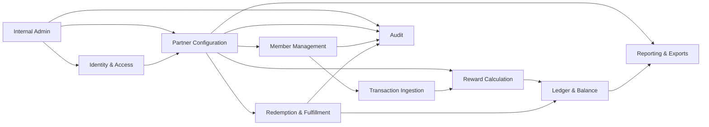

# Loyalty Platform Bounded Contexts

## Product Frame

Paisa is a managed loyalty infrastructure hub for companies that want customer loyalty programs without building internal tooling for member management, benefit management, reward calculation, redemption, refunds, and fulfillment.

The application should be treated as a clean-sheet B2B loyalty platform. Existing wallet-oriented database tables, API contracts, and frontend screens are prototype artifacts and should not constrain the target design.

## Core Users

- Paisa internal admins: onboard partners, invite partner admins, impersonate partner users, and manage operations.
- Partner admins: configure programs, earning rules, catalog items, members, and integrations.
- Partner operators/support users: inspect members, balances, transactions, redemptions, refunds, and fulfillment status.
- Members/account holders: partner customers who earn and redeem rewards. V1 does not require a member-facing Paisa portal.

## System-Wide Invariants

- Partner creation is controlled by Paisa internal users.
- Partner users belong to exactly one partner.
- Paisa internal admins have god access and can impersonate partner users.
- Every impersonation requires actor, target, reason, timestamp, and audit trail.
- Every partner-owned record must be scoped to exactly one partner.
- Partner ID is inferred from authenticated session or API key for partner-facing APIs.
- A member must exist before a transaction can be ingested for that member.
- Each internal member/customer has one loyalty account per partner.
- Members do not store raw PII in v1.
- A member identity is represented by Paisa's internal member ID plus a partner-provided external customer ID.
- Optional phone/email lookup should be stored as hashed identifiers only.
- Members support `active`, `suspended`, and `closed` statuses.
- Balances are never directly mutated.
- Points move only through immutable ledger entries.
- Ledger corrections use compensating entries, never in-place edits.
- Available, reserved, and expired balance buckets are tracked.
- The expired bucket is only for earned-point expiration.
- Timed-out redemption reservations are released back to available points; they are not expired points.
- Redemptions cannot make available balance negative.
- Refunds can make available balance negative.
- Transaction ingestion is asynchronous.
- Ingestion idempotency boundary is `partner_id + external_transaction_id`.
- Raw transaction events are immutable after ingestion.
- Purchase and refund are the v1 transaction event types.
- Transactions can include line items.
- Earning rules are versioned.
- Published rule versions are immutable.
- Reward calculations reference the transaction, program, and rule version used.
- Coupon code is the only v1 redemption type.
- Coupon redemption is automatic.
- Redemption reserves points first.
- Failed coupon fulfillment automatically refunds points.
- Daily ledger export is required for redemption/liability reporting.

## Context Map



## Internal Admin Context

Owns Paisa-operated setup and privileged operations.

Responsibilities:

- Create and manage partners.
- Invite first partner admins.
- Suspend or reactivate partners.
- Impersonate partner users for support.
- View partner operational health.

Primary concepts:

- Internal user
- Partner onboarding
- Impersonation session

Boundaries:

- Does not own partner earning rules.
- Does not directly mutate balances.
- Does not bypass audit for sensitive operations.

Key events:

- `PartnerCreated`
- `PartnerSuspended`
- `PartnerUserInvited`
- `ImpersonationStarted`
- `ImpersonationEnded`

## Identity And Access Context

Owns authentication, authorization, session handling, and API-key authentication.

Responsibilities:

- Authenticate internal users.
- Authenticate partner users.
- Validate partner API keys for ingestion.
- Resolve actor identity and partner scope.
- Enforce roles and permissions.

Primary concepts:

- Internal session
- Partner session
- Impersonated session
- API key
- Role

Boundaries:

- Does not own partner business configuration.
- Does not own member lifecycle.
- Does not calculate rewards.

Key invariants:

- Partner users belong to exactly one partner.
- API keys resolve to exactly one partner.
- Partner-facing APIs do not trust partner IDs in request bodies.

## Partner Configuration Context

Owns the partner's loyalty platform configuration.

Responsibilities:

- Manage partner programs.
- Represent tiers as partner programs.
- Create draft rule versions.
- Publish immutable earning rule versions.
- Configure earning basis by program.
- Manage coupon catalog items.

Primary concepts:

- Partner
- Program
- Program rule version
- Earning rule
- Catalog item

Boundaries:

- Does not ingest transactions.
- Does not write ledger entries.
- Does not store member balances.

Key invariants:

- A partner can have multiple programs.
- A member has one active program enrollment in v1.
- Draft rule versions cannot evaluate live transactions.
- Reward calculations only use published rule versions.

## Member Management Context

Owns partner customers and their loyalty account enrollment.

Responsibilities:

- Create members.
- Store partner external customer mapping.
- Store optional hashed identifiers.
- Create the member's single loyalty account.
- Manage member status.
- Enroll members into programs.

Primary concepts:

- Member
- Member identifier
- Member account
- Program enrollment

Boundaries:

- Does not store raw PII in v1.
- Does not calculate points.
- Does not directly mutate balances.

Key invariants:

- Members are partner-scoped.
- `partner_id + external_customer_id` identifies a member from partner input.
- One member account exists per member.
- Transactions cannot be accepted for unknown members.

## Transaction Ingestion Context

Owns raw transaction intake and ingestion lifecycle.

Responsibilities:

- Accept purchase and refund transaction events.
- Validate partner API key.
- Validate referenced member exists.
- Store raw payload and normalized transaction fields.
- Store optional line items.
- Enforce idempotency.
- Track ingestion status.
- Queue asynchronous reward calculation.

Primary concepts:

- Transaction event
- Transaction line item
- Ingestion status

Boundaries:

- Does not calculate points inline as source of truth.
- Does not write ledger entries directly.
- Does not create members automatically.

Key invariants:

- `partner_id + external_transaction_id` is unique.
- Raw payload is preserved.
- Corrections happen through new refund/reversal events.
- Purchases and refunds are separate transaction events.

## Reward Calculation Context

Owns interpretation of transaction events into reward outcomes.

Responsibilities:

- Load the member's active program.
- Load the active published rule version.
- Calculate points from normalized transaction amounts and configured earning basis.
- Support constrained v1 earning rules.
- Store calculation result.
- Request ledger posting for calculated point movement.

V1 rule capabilities:

- Points per dollar.
- Fixed points per transaction.
- First purchase bonus.
- Purchase amount in X days bonus.

Primary concepts:

- Reward calculation
- Calculation status
- Calculation data

Boundaries:

- Does not mutate balances directly.
- Does not edit rule versions.
- Does not own transaction ingestion.

Key invariants:

- Every calculation references a transaction event.
- Every successful calculation references a program and rule version.
- Failed calculations are stored with a failure reason.

## Ledger And Balance Context

Owns points accounting.

Responsibilities:

- Write immutable ledger entries.
- Maintain available, reserved, and expired balance snapshots.
- Enforce spend constraints.
- Support compensating entries for refunds and adjustments.
- Expire earned points into the expired bucket when partner policy requires it.
- Release timed-out reservations from reserved back to available.
- Answer balance and ledger history queries.

Primary concepts:

- Ledger entry
- Balance snapshot
- Source reference

Boundaries:

- Does not own coupon assignment.
- Does not calculate rewards.
- Does not accept raw transaction ingestion.

Key invariants:

- Ledger entries are insert-only.
- Balance snapshots are cache/rebuild artifacts.
- Balance snapshots must be updated transactionally with ledger entries.
- Redemptions cannot make available balance negative.
- Refunds can make available balance negative.
- `points_expiration` moves available points into the expired bucket.
- `reservation_release` moves reserved points back to available and never touches the expired bucket.
- Every ledger entry has a source type and source ID.

## Redemption And Fulfillment Context

Owns spending points for coupon codes.

Responsibilities:

- Create coupon redemptions.
- Reserve points.
- Track reservation timeout.
- Assign coupon code.
- Fulfill automatically.
- Auto-refund points if fulfillment fails.
- Release reserved points if a reservation times out before fulfillment.
- Store fulfillment history.

Primary concepts:

- Catalog item
- Coupon code
- Redemption
- Fulfillment event

Boundaries:

- Does not calculate earning rewards.
- Does not directly edit balance snapshots.
- Uses Ledger context to reserve, capture, and refund points.

V1 redemption states:

- `requested`
- `reserved`
- `fulfilled`
- `failed`
- `refunded`
- `reservation_released`

Key invariants:

- Coupon code is the only v1 redemption type.
- Redemption reserves points before issuing a coupon.
- Failed fulfillment creates a reservation release when points are still reserved.
- Reservation timeout creates a `reservation_release` ledger entry, not a `points_expiration` entry.

## Reporting And Export Context

Owns reporting artifacts and scheduled exports.

Responsibilities:

- Generate daily ledger liability exports.
- Track export status and history.
- Provide redemption liability summaries.
- Support partner reporting views.

Primary concepts:

- Ledger export
- Export file
- Business date

Boundaries:

- Reports read ledger data.
- Reports do not mutate rewards, redemptions, or balances.

Key invariants:

- Daily liability export is reproducible for a partner and business date.
- Exports are partner-scoped.

## Audit Context

Owns sensitive action history across the platform.

Responsibilities:

- Record actor, action, target, details, and timestamp.
- Support internal audit views.
- Record impersonation and privileged operations.

Primary concepts:

- Audit event

Must audit:

- Partner creation or suspension.
- Partner user invite or role change.
- Impersonation start/end.
- API key creation or revocation.
- Rule version publish.
- Manual adjustment.
- Redemption refund.

## Recommended Physical Service Shape

Start as a modular Go monolith with explicit package boundaries:

```text
internal/admin
internal/auth
internal/partners
internal/members
internal/ingestion
internal/rewards
internal/ledger
internal/redemptions
internal/reporting
internal/audit
```

Context packages should expose services/commands rather than allowing other contexts to reach into their tables casually. The monolith can share infrastructure packages for database access, HTTP helpers, auth middleware, UUID/time helpers, and logging.

## Vertical Slice

The first build should prove the full loyalty lifecycle:

1. Internal admin creates partner.
2. Internal admin invites partner admin.
3. Partner admin creates programs and publishes v1 earning rules.
4. Partner admin creates member and enrolls them in a program.
5. Partner sends async purchase transaction through API key ingestion.
6. Reward calculation posts earned points through ledger.
7. Partner views member balance and ledger.
8. Member redeems points for a coupon code through partner portal/API.
9. Failed fulfillment auto-refunds points.
10. Daily ledger liability export is generated.
