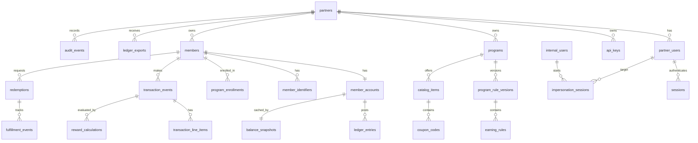

# Loyalty Platform Data Model And API Design

## Design Goals

- Model Paisa as a clean-sheet B2B loyalty platform.
- Keep every partner-owned record tenant-scoped with `partner_id`.
- Use immutable transaction, calculation, ledger, redemption, fulfillment, and audit histories.
- Keep reward balances ledger-backed.
- Support async transaction ingestion and automatic coupon-code redemption in v1.
- Avoid storing raw PII in v1.

## General Database Conventions

- Database: Postgres.
- Primary keys: UUID.
- Time columns: `timestamptz`.
- Money columns: integer minor units, such as cents.
- Points columns: integer point units.
- Partner-specific payload/config columns: `jsonb`.
- Status columns: constrained strings or enums.
- Every table should have `created_at`.
- Mutable business tables should have `updated_at`.
- Partner-owned tables should include `partner_id`, even when reachable through another FK.

## Relationship Map



## Admin, Partner, And IAM Tables

### `partners`

Root tenant record for client companies.

| Column | Type | Notes |
| --- | --- | --- |
| `id` | uuid pk | Partner ID. |
| `name` | text | Display name. |
| `status` | text | `active`, `suspended`, `closed`. |
| `onboarding_status` | text | `created`, `configured`, `live`. |
| `created_by_internal_user_id` | uuid fk nullable | FK to `internal_users.id`. |
| `created_at` | timestamptz | Required. |
| `updated_at` | timestamptz | Required. |

Indexes and constraints:

- Index on `status`.

### `internal_users`

Paisa team users.

| Column | Type | Notes |
| --- | --- | --- |
| `id` | uuid pk | Internal user ID. |
| `email` | text | Unique login email. |
| `password_hash` | text | Hashed password. |
| `role` | text | `admin`, `operator`, `support`. |
| `status` | text | `active`, `suspended`, `closed`. |
| `created_at` | timestamptz | Required. |
| `updated_at` | timestamptz | Required. |

Indexes and constraints:

- Unique index on `lower(email)`.

### `partner_users`

Users who access the partner portal.

| Column | Type | Notes |
| --- | --- | --- |
| `id` | uuid pk | Partner user ID. |
| `partner_id` | uuid fk | FK to `partners.id`. |
| `email` | text | Login email. |
| `password_hash` | text | Hashed password. |
| `role` | text | `admin`, `operator`, `support`. |
| `status` | text | `active`, `suspended`, `closed`. |
| `created_at` | timestamptz | Required. |
| `updated_at` | timestamptz | Required. |

Indexes and constraints:

- Unique index on `(partner_id, lower(email))`.
- Index on `(partner_id, status)`.

### `sessions`

Authenticated internal, partner, and impersonated sessions.

| Column | Type | Notes |
| --- | --- | --- |
| `id` | uuid pk | Session ID/token ID. |
| `actor_type` | text | `internal_user`, `partner_user`. |
| `actor_id` | uuid | ID of authenticated actor. |
| `partner_id` | uuid nullable | FK to `partners.id` when session is partner-scoped. |
| `impersonation_id` | uuid nullable | FK to `impersonation_sessions.id`. |
| `expires_at` | timestamptz | Required. |
| `created_at` | timestamptz | Required. |
| `revoked_at` | timestamptz nullable | Set on logout/revocation. |

Indexes and constraints:

- Index on `(actor_type, actor_id)`.
- Index on `partner_id`.
- Index on `expires_at`.

### `api_keys`

Partner API keys for ingestion.

| Column | Type | Notes |
| --- | --- | --- |
| `id` | uuid pk | API key ID. |
| `partner_id` | uuid fk | FK to `partners.id`. |
| `key_prefix` | text | Non-secret display prefix. |
| `key_hash` | text | Hash of raw API key. |
| `scopes` | text[] | Example: `transaction:write`. |
| `status` | text | `active`, `revoked`. |
| `last_used_at` | timestamptz nullable | Updated on use. |
| `created_at` | timestamptz | Required. |
| `revoked_at` | timestamptz nullable | Required when revoked. |

Indexes and constraints:

- Unique index on `key_hash`.
- Index on `(partner_id, status)`.

### `impersonation_sessions`

Audit anchor for internal admin god-access sessions.

| Column | Type | Notes |
| --- | --- | --- |
| `id` | uuid pk | Impersonation session ID. |
| `internal_user_id` | uuid fk | FK to `internal_users.id`. |
| `partner_user_id` | uuid fk | FK to `partner_users.id`. |
| `reason` | text | Required. |
| `started_at` | timestamptz | Required. |
| `ended_at` | timestamptz nullable | Set when ended. |

Indexes and constraints:

- Index on `internal_user_id`.
- Index on `partner_user_id`.
- Index on `started_at`.

## Programs And Members Tables

### `programs`

Partner-defined loyalty programs. Tiers are modeled as programs.

| Column | Type | Notes |
| --- | --- | --- |
| `id` | uuid pk | Program ID. |
| `partner_id` | uuid fk | FK to `partners.id`. |
| `name` | text | Example: Gold, Platinum, VIP. |
| `tier_code` | text | Partner-defined stable code. |
| `status` | text | `draft`, `active`, `archived`. |
| `priority` | integer | Used if automation later evaluates eligible programs. |
| `created_at` | timestamptz | Required. |
| `updated_at` | timestamptz | Required. |

Indexes and constraints:

- Unique index on `(partner_id, tier_code)`.
- Index on `(partner_id, status)`.

### `members`

Partner customers/account holders without raw PII.

| Column | Type | Notes |
| --- | --- | --- |
| `id` | uuid pk | Paisa internal member ID. |
| `partner_id` | uuid fk | FK to `partners.id`. |
| `external_customer_id` | text | Partner's customer ID. |
| `status` | text | `active`, `suspended`, `closed`. |
| `created_at` | timestamptz | Required. |
| `updated_at` | timestamptz | Required. |

Indexes and constraints:

- Unique index on `(partner_id, external_customer_id)`.
- Index on `(partner_id, status)`.

### `member_identifiers`

Optional hashed email/phone lookup helpers.

| Column | Type | Notes |
| --- | --- | --- |
| `id` | uuid pk | Identifier ID. |
| `partner_id` | uuid fk | FK to `partners.id`. |
| `member_id` | uuid fk | FK to `members.id`. |
| `type` | text | `email_hash`, `phone_hash`. |
| `value_hash` | text | Hash of normalized identifier. |
| `created_at` | timestamptz | Required. |

Indexes and constraints:

- Unique index on `(partner_id, type, value_hash)`.
- Index on `(member_id)`.

### `member_accounts`

Single rewards account per member.

| Column | Type | Notes |
| --- | --- | --- |
| `id` | uuid pk | Account ID. |
| `partner_id` | uuid fk | FK to `partners.id`. |
| `member_id` | uuid fk | FK to `members.id`. |
| `status` | text | `active`, `suspended`, `closed`. |
| `created_at` | timestamptz | Required. |
| `updated_at` | timestamptz | Required. |

Indexes and constraints:

- Unique index on `member_id`.
- Index on `(partner_id, status)`.

### `program_enrollments`

Current and historical member program assignments.

| Column | Type | Notes |
| --- | --- | --- |
| `id` | uuid pk | Enrollment ID. |
| `partner_id` | uuid fk | FK to `partners.id`. |
| `member_id` | uuid fk | FK to `members.id`. |
| `program_id` | uuid fk | FK to `programs.id`. |
| `status` | text | `active`, `ended`. |
| `started_at` | timestamptz | Required. |
| `ended_at` | timestamptz nullable | Required when ended. |

Indexes and constraints:

- Partial unique index on `(member_id)` where `status = 'active'`.
- Index on `(partner_id, program_id, status)`.

## Rules And Ingestion Tables

### `program_rule_versions`

Versioned earning configuration for a program.

| Column | Type | Notes |
| --- | --- | --- |
| `id` | uuid pk | Rule version ID. |
| `partner_id` | uuid fk | FK to `partners.id`. |
| `program_id` | uuid fk | FK to `programs.id`. |
| `version` | integer | Monotonic per program. |
| `status` | text | `draft`, `published`, `archived`. |
| `earn_basis` | text | `subtotal`, `total`, `eligible`, `line_item_eligible`. |
| `published_at` | timestamptz nullable | Set when published. |
| `created_at` | timestamptz | Required. |
| `updated_at` | timestamptz | Required. |

Indexes and constraints:

- Unique index on `(program_id, version)`.
- At most one published active version per program if the product wants one live version at a time.
- Index on `(partner_id, program_id, status)`.

### `earning_rules`

Rules contained by a rule version.

| Column | Type | Notes |
| --- | --- | --- |
| `id` | uuid pk | Rule ID. |
| `rule_version_id` | uuid fk | FK to `program_rule_versions.id`. |
| `rule_type` | text | `points_per_dollar`, `fixed_per_transaction`, `first_purchase_bonus`, `spend_window_bonus`. |
| `priority` | integer | Evaluation order. |
| `status` | text | `active`, `disabled`. |
| `config` | jsonb | Rule-specific configuration. |
| `created_at` | timestamptz | Required. |
| `updated_at` | timestamptz | Required. |

Indexes and constraints:

- Index on `(rule_version_id, status, priority)`.

Example configs:

```json
{
  "rule_type": "points_per_dollar",
  "points_per_dollar": 5,
  "rounding": "floor"
}
```

```json
{
  "rule_type": "fixed_per_transaction",
  "points": 100
}
```

```json
{
  "rule_type": "first_purchase_bonus",
  "points": 500
}
```

```json
{
  "rule_type": "spend_window_bonus",
  "window_days": 30,
  "spend_threshold_minor": 10000,
  "points": 1000
}
```

### `transaction_events`

Raw and normalized purchase/refund events.

| Column | Type | Notes |
| --- | --- | --- |
| `id` | uuid pk | Transaction event ID. |
| `partner_id` | uuid fk | FK to `partners.id`. |
| `member_id` | uuid fk | FK to `members.id`. |
| `external_transaction_id` | text | Partner transaction ID. |
| `original_external_transaction_id` | text nullable | Required for refunds when available. |
| `type` | text | `purchase`, `refund`. |
| `status` | text | `accepted`, `processing`, `processed`, `failed`, `duplicate`. |
| `currency` | char(3) | ISO currency code. |
| `subtotal_minor` | integer nullable | Amount before tax. |
| `tax_minor` | integer nullable | Tax amount. |
| `total_minor` | integer nullable | Total amount. |
| `eligible_minor` | integer nullable | Partner-provided eligible amount. |
| `occurred_at` | timestamptz | Partner event time. |
| `raw_payload` | jsonb | Sanitized transaction payload retained for rule inputs/debugging. Raw customer identifiers should not be stored here. |
| `payload_hash` | text | Hash for duplicate diagnostics. |
| `created_at` | timestamptz | Required. |
| `updated_at` | timestamptz | Required. |

Indexes and constraints:

- Unique index on `(partner_id, external_transaction_id)`.
- Index on `(partner_id, member_id, occurred_at)`.
- Index on `(partner_id, status, created_at)`.

### `transaction_line_items`

Optional line-item detail for transaction events.

| Column | Type | Notes |
| --- | --- | --- |
| `id` | uuid pk | Line item ID. |
| `transaction_event_id` | uuid fk | FK to `transaction_events.id`. |
| `external_line_id` | text nullable | Partner line item ID. |
| `sku` | text nullable | Partner SKU. |
| `category` | text nullable | Partner category. |
| `quantity` | integer | Quantity. |
| `subtotal_minor` | integer nullable | Line subtotal. |
| `tax_minor` | integer nullable | Line tax. |
| `total_minor` | integer nullable | Line total. |
| `eligible_minor` | integer nullable | Partner-provided line eligible amount. |
| `created_at` | timestamptz | Required. |

Indexes and constraints:

- Index on `transaction_event_id`.
- Optional unique index on `(transaction_event_id, external_line_id)` where `external_line_id is not null`.

## Rewards, Ledger, And Redemption Tables

### `reward_calculations`

Async reward calculation output.

| Column | Type | Notes |
| --- | --- | --- |
| `id` | uuid pk | Calculation ID. |
| `partner_id` | uuid fk | FK to `partners.id`. |
| `transaction_event_id` | uuid fk | FK to `transaction_events.id`. |
| `program_id` | uuid fk | FK to `programs.id`. |
| `rule_version_id` | uuid fk | FK to `program_rule_versions.id`. |
| `status` | text | `succeeded`, `failed`, `skipped`. |
| `points_delta` | integer | Positive for purchases, negative for refunds. |
| `basis_amount_minor` | integer nullable | Amount used for earning calculation. |
| `calculation_data` | jsonb | Structured details for support/debugging. |
| `failure_reason` | text nullable | Required for failed/skipped when applicable. |
| `created_at` | timestamptz | Required. |

Indexes and constraints:

- Unique index on `transaction_event_id`.
- Index on `(partner_id, status, created_at)`.
- Index on `(program_id, rule_version_id)`.

### `ledger_entries`

Immutable source of truth for point movement.

| Column | Type | Notes |
| --- | --- | --- |
| `id` | uuid pk | Ledger entry ID. |
| `partner_id` | uuid fk | FK to `partners.id`. |
| `member_account_id` | uuid fk | FK to `member_accounts.id`. |
| `program_id` | uuid fk nullable | FK to `programs.id`. |
| `entry_type` | text | `earn`, `refund`, `redemption_reserve`, `redemption_capture`, `reservation_release`, `adjustment`, `points_expiration`. |
| `available_delta` | integer | Delta to available bucket. |
| `reserved_delta` | integer | Delta to reserved bucket. |
| `expired_delta` | integer | Delta to expired bucket. |
| `source_type` | text | `reward_calculation`, `refund_transaction`, `redemption`, `manual_adjustment`, `reservation_timeout_job`, `points_expiration_job`. |
| `source_id` | uuid | ID of source record. |
| `reason` | text nullable | Required for manual adjustments. |
| `created_by_type` | text | `system`, `internal_user`, `partner_user`. |
| `created_by_id` | uuid nullable | Null for system-created entries. |
| `created_at` | timestamptz | Required. |

Indexes and constraints:

- Index on `(partner_id, member_account_id, created_at)`.
- Index on `(partner_id, source_type, source_id)`.
- App code must treat rows as insert-only.

Ledger patterns:

- Purchase earn: `available_delta > 0`.
- Refund clawback: `available_delta < 0`; may make balance negative.
- Redemption reservation (`redemption_reserve`): `available_delta < 0`, `reserved_delta > 0`.
- Redemption capture (`redemption_capture`): `reserved_delta < 0`.
- Reservation timeout or failed pre-capture fulfillment (`reservation_release`): `reserved_delta < 0`, `available_delta > 0`.
- Earned point expiration (`points_expiration`): `available_delta < 0`, `expired_delta > 0`.

Naming rules:

- `points_expiration` is only for partner-configured expiration of earned available points.
- `reservation_release` is only for returning reserved redemption points back to available.
- Reservation release never increases `expired_delta`.
- Earned point expiration never touches `reserved_delta`.

Implementation validation:

- DB-backed service tests should validate transaction isolation, row locking, idempotent posting, concurrent reservation attempts, balance snapshot updates, and SQL ledger rebuild queries.

### `balance_snapshots`

Cached balances, rebuildable from ledger.

| Column | Type | Notes |
| --- | --- | --- |
| `member_account_id` | uuid pk/fk | FK to `member_accounts.id`. |
| `partner_id` | uuid fk | FK to `partners.id`. |
| `available_points` | integer | Current available balance. |
| `reserved_points` | integer | Current reserved balance. |
| `expired_points` | integer | Historical earned points moved out of available by `points_expiration`. |
| `updated_at` | timestamptz | Required. |

Indexes and constraints:

- Index on `(partner_id, updated_at)`.
- Must be updated in the same DB transaction as ledger insert.

### `catalog_items`

Redeemable coupon offers.

| Column | Type | Notes |
| --- | --- | --- |
| `id` | uuid pk | Catalog item ID. |
| `partner_id` | uuid fk | FK to `partners.id`. |
| `program_id` | uuid fk nullable | Null means available to all partner programs. |
| `name` | text | Display name. |
| `description` | text nullable | Display/ops description. |
| `points_cost` | integer | Redemption price. |
| `status` | text | `active`, `inactive`, `archived`. |
| `metadata` | jsonb | Partner-specific display/config. |
| `created_at` | timestamptz | Required. |
| `updated_at` | timestamptz | Required. |

Indexes and constraints:

- Index on `(partner_id, status)`.
- Index on `(partner_id, program_id)`.

### `coupon_codes`

Inventory of coupon codes for catalog items.

| Column | Type | Notes |
| --- | --- | --- |
| `id` | uuid pk | Coupon code ID. |
| `catalog_item_id` | uuid fk | FK to `catalog_items.id`. |
| `code_encrypted` | text | Encrypted coupon code. |
| `status` | text | `available`, `reserved`, `issued`, `voided`. |
| `redemption_id` | uuid nullable | FK to `redemptions.id` once assigned. |
| `created_at` | timestamptz | Required. |
| `updated_at` | timestamptz | Required. |

Indexes and constraints:

- Index on `(catalog_item_id, status)`.
- Unique index on `redemption_id` where `redemption_id is not null`.

### `redemptions`

Coupon redemption lifecycle.

| Column | Type | Notes |
| --- | --- | --- |
| `id` | uuid pk | Redemption ID. |
| `partner_id` | uuid fk | FK to `partners.id`. |
| `member_id` | uuid fk | FK to `members.id`. |
| `member_account_id` | uuid fk | FK to `member_accounts.id`. |
| `catalog_item_id` | uuid fk | FK to `catalog_items.id`. |
| `status` | text | `requested`, `reserved`, `fulfilled`, `failed`, `refunded`, `reservation_released`. |
| `points_cost` | integer | Cost at redemption time. |
| `coupon_code_id` | uuid nullable | FK to `coupon_codes.id`. |
| `reservation_expires_at` | timestamptz nullable | Deadline for releasing reserved points if not fulfilled/captured. |
| `failure_reason` | text nullable | Required on failure. |
| `created_at` | timestamptz | Required. |
| `updated_at` | timestamptz | Required. |

Indexes and constraints:

- Index on `(partner_id, member_id, created_at)`.
- Index on `(partner_id, status, created_at)`.

### `fulfillment_events`

Append-only redemption status history.

| Column | Type | Notes |
| --- | --- | --- |
| `id` | uuid pk | Fulfillment event ID. |
| `redemption_id` | uuid fk | FK to `redemptions.id`. |
| `status` | text | Mirrors redemption lifecycle status. |
| `details` | jsonb | Fulfillment metadata/failure detail. |
| `created_at` | timestamptz | Required. |

Indexes and constraints:

- Index on `(redemption_id, created_at)`.

## Reporting And Audit Tables

### `ledger_exports`

Daily partner liability export tracking.

| Column | Type | Notes |
| --- | --- | --- |
| `id` | uuid pk | Export ID. |
| `partner_id` | uuid fk | FK to `partners.id`. |
| `business_date` | date | Export date. |
| `status` | text | `pending`, `running`, `complete`, `failed`. |
| `file_path` | text nullable | Storage path when complete. |
| `summary` | jsonb | Totals and counts. |
| `created_at` | timestamptz | Required. |
| `updated_at` | timestamptz | Required. |

Indexes and constraints:

- Unique index on `(partner_id, business_date)`.
- Index on `(partner_id, status)`.

### `audit_events`

Sensitive action history.

| Column | Type | Notes |
| --- | --- | --- |
| `id` | uuid pk | Audit event ID. |
| `partner_id` | uuid nullable | Null only for global internal actions. |
| `actor_type` | text | `system`, `internal_user`, `partner_user`. |
| `actor_id` | uuid nullable | Null for system. |
| `impersonation_id` | uuid nullable | FK to `impersonation_sessions.id`. |
| `action` | text | Stable action name. |
| `target_type` | text | Example: `partner`, `program_rule_version`, `redemption`. |
| `target_id` | uuid nullable | Target record ID. |
| `details` | jsonb | Action metadata. |
| `created_at` | timestamptz | Required. |

Indexes and constraints:

- Index on `(partner_id, created_at)`.
- Index on `(actor_type, actor_id, created_at)`.
- Index on `(target_type, target_id)`.

## Public API Boundaries

### Internal Paisa APIs

Used by Paisa internal users.

```text
POST /internal/v1/auth/login
POST /internal/v1/partners
GET  /internal/v1/partners
GET  /internal/v1/partners/{partnerId}
PATCH /internal/v1/partners/{partnerId}
POST /internal/v1/partners/{partnerId}/users
POST /internal/v1/impersonations
DELETE /internal/v1/impersonations/{impersonationId}
GET  /internal/v1/audit-events
```

### Partner Portal APIs

Used by partner users. Partner scope is inferred from session.

```text
POST /partner/v1/auth/login
GET  /partner/v1/me
GET  /partner/v1/dashboard

POST /partner/v1/programs
GET  /partner/v1/programs
GET  /partner/v1/programs/{programId}
PATCH /partner/v1/programs/{programId}
POST /partner/v1/programs/{programId}/rule-versions
POST /partner/v1/programs/{programId}/rule-versions/{versionId}/publish

POST /partner/v1/members
GET  /partner/v1/members
GET  /partner/v1/members/{memberId}
PATCH /partner/v1/members/{memberId}
PUT  /partner/v1/members/{memberId}/program-enrollment
GET  /partner/v1/members/{memberId}/balance
GET  /partner/v1/members/{memberId}/ledger
POST /partner/v1/members/{memberId}/adjustments

POST /partner/v1/catalog-items
GET  /partner/v1/catalog-items
POST /partner/v1/catalog-items/{catalogItemId}/coupon-codes

POST /partner/v1/members/{memberId}/redemptions
GET  /partner/v1/redemptions
GET  /partner/v1/redemptions/{redemptionId}

GET  /partner/v1/exports/ledger-liability
```

### Partner Ingestion APIs

Used by partner systems with API-key auth. Partner scope is inferred from API key.

```text
POST /partner/v1/ingest/transactions
GET  /partner/v1/ingest/transactions/{transactionEventId}
POST /partner/v1/ingest/transactions/{transactionEventId}/reprocess
```

## Important Request Shapes

### Create Member

```json
{
  "external_customer_id": "cust_123",
  "identifiers": [
    {
      "type": "email",
      "value": "normalized-or-raw-value-to-hash-before-storage"
    }
  ],
  "program_id": "uuid"
}
```

Storage behavior:

- Store `external_customer_id` on `members`.
- Hash optional identifiers before storing in `member_identifiers`.
- Create `member_accounts`.
- Create active `program_enrollments`.

### Ingest Transaction

```json
{
  "external_transaction_id": "txn_123",
  "external_customer_id": "cust_123",
  "type": "purchase",
  "currency": "USD",
  "subtotal_minor": 10000,
  "tax_minor": 600,
  "total_minor": 10600,
  "eligible_minor": 10000,
  "occurred_at": "2026-07-24T12:00:00Z",
  "line_items": [
    {
      "external_line_id": "line_1",
      "sku": "sku_abc",
      "category": "apparel",
      "quantity": 1,
      "subtotal_minor": 10000,
      "tax_minor": 600,
      "total_minor": 10600,
      "eligible_minor": 10000
    }
  ]
}
```

Response behavior:

- Return accepted transaction event status.
- Do not require synchronous reward calculation in v1.
- If the same `partner_id + external_transaction_id` arrives again, return the existing event instead of double processing.

### Create Redemption

```json
{
  "catalog_item_id": "uuid"
}
```

Processing behavior:

- Validate member/account/program eligibility.
- Validate available balance is sufficient.
- Write `redemption_reserve` ledger entry.
- Assign available coupon code.
- Mark redemption fulfilled and write `redemption_capture` ledger entry when reserved points are consumed.
- If coupon assignment fails while points are still reserved, write `reservation_release` ledger entry and mark redemption `reservation_released` or `failed`.
- If a reservation passes `reservation_expires_at` before fulfillment, write `reservation_release` ledger entry and mark redemption `reservation_released`.

## Vertical Slice Acceptance Flow

1. Internal user creates partner.
2. Internal user invites partner admin.
3. Partner admin creates one or more programs.
4. Partner admin publishes a rule version for a program.
5. Partner admin creates a member with external customer ID.
6. Partner admin enrolls member in a program.
7. Partner creates API key.
8. Partner ingests purchase event.
9. System stores transaction event and line items.
10. Async worker calculates points.
11. Ledger entry posts earned points.
12. Balance snapshot reflects available points.
13. Partner creates catalog item and uploads coupon code.
14. Member redemption reserves points and issues coupon code.
15. Failed fulfillment path releases/refunds points automatically.
16. Daily ledger export can be generated for the partner.

## Backend Validation Coverage

Backend tests should cover rule group resolution, caps, dependencies, publish validation, ledger mechanics, active program enrollment, partner-scoped idempotency, payload conflicts, immutable accepted events, unknown-member rejection, async status transitions, and refund reversal behavior.
