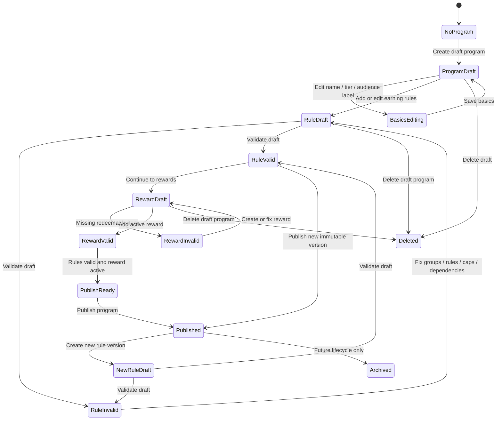
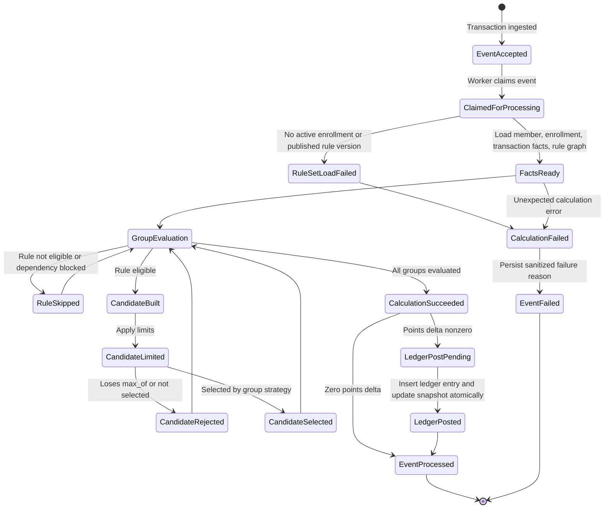
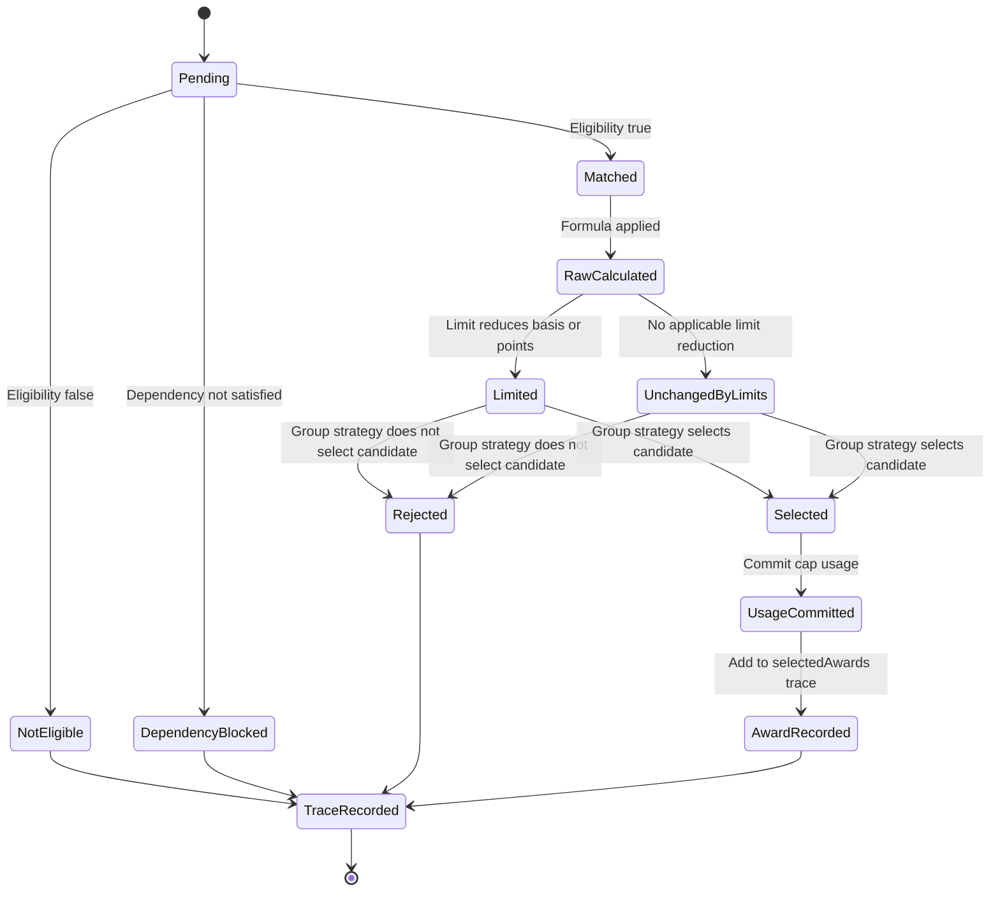
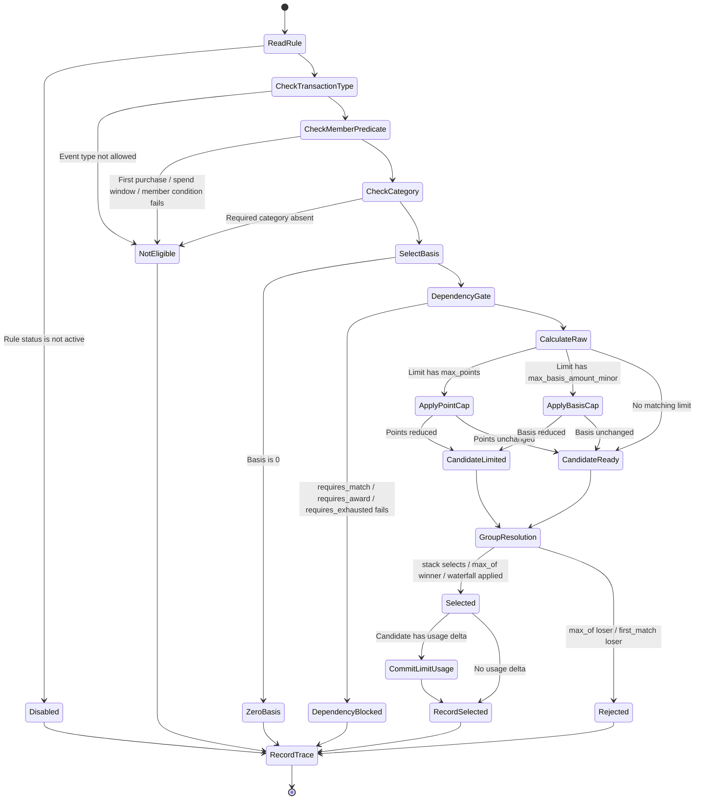

# Loyalty Platform Rule Engine Design

## Problem

Partner loyalty rules will not stay as simple as "if purchase, award X points." A realistic platform needs to support:

- A base earn rule plus one or more bonuses.
- Independent bonuses that can stack.
- Base-vs-bonus logic where the member earns the max of either result.
- Bonus caps where the capped bonus may lose to base earn.
- Dependent rules where a second lower earn rate is triggered only after a first rule reaches a limit.
- Rules that are narrow in eligibility but still feed later overflow behavior.
- Purchase, refund, and adjustment flows without directly mutating balances.

The rule engine should model calculation as a constrained graph of rule groups and candidates, not as arbitrary partner-provided code.

## Design Principle

A rule should not directly mutate points. A rule produces an earn candidate.

The engine:

1. Loads the member, member account, active program, and published rule-set version.
2. Normalizes the transaction into calculation facts.
3. Evaluates rule groups by priority.
4. Evaluates eligible rules within each group.
5. Produces candidate awards.
6. Applies limits and dependencies.
7. Resolves selected candidates through the group's strategy.
8. Persists the calculation trace.
9. Posts selected point movement through the ledger.

```text
Transaction event
  -> calculation facts
  -> eligible rule groups
  -> eligible rules
  -> candidate awards
  -> limits/dependencies
  -> selected awards
  -> reward calculation
  -> ledger entries
```

## State Model

The rule system has two separate state machines:

- Configuration state: what a partner admin is building, reviewing, and publishing.
- Calculation state: what the backend does for one transaction after it has an immutable published rule version.

Keeping these separate avoids a common product mistake: exposing runtime concepts like candidate selection, cap usage, or ledger posting as partner-editable controls. Partners configure rules; the engine calculates candidates and posts selected outcomes.

### Configuration State Diagram



Configuration invariants:

- A program can be created as an operational database row before it is product-published.
- Product-published means the program has at least one published base rule version and at least one active reward or a deliberate rewardless mode.
- Draft rule versions can be edited freely.
- Published rule versions are immutable.
- Draft rule versions never evaluate live transactions.
- Publishing a new base rule version archives the prior published base version for that program.
- Deleting a draft program is allowed only before live history exists.
- A program with enrollments, calculations, ledger entries, published or archived rules, redemptions, campaigns, or member rule assignments cannot be deleted through the draft delete action.

### Partner Control Levels

Controls should be exposed at the level where the partner is actually making a decision.

| Level | Partner intent | Exposed controls | Hidden engine behavior |
| --- | --- | --- | --- |
| Program | Define a loyalty audience or tier. | Create draft program, edit basics, delete draft, publish program. | Program row exists for ownership and setup before product publish. |
| Rule version | Create an immutable earning configuration. | Create new draft version, validate, publish version through program publish. | Version numbers, archive prior published version, immutable published graph. |
| Rule group | Define how related rules interact. | Strategy: `stack`, `max_of`, `waterfall`; group name; group priority later. | Group candidate collection and selected-award resolution. |
| Rule | Define one earn candidate. | Rule type, category/audience eligibility, earn basis, rate/fixed points, status. | Eligibility normalization, basis extraction, integer rounding. |
| Limit | Cap basis or points. | Friendly cap fields like first `$50.00` basis/month or `300 points/month`. | `rule_limits`, period keys, limit usage commit only if selected. |
| Dependency | Express relationship between rules. | Guided choices like "after previous cap is exhausted". | Dependency graph validation, cycle prevention, blocked candidate traces. |
| Reward | Define redemption option. | Create reward, points cost, active/inactive. | Reservation, validation, capture, release, ledger reserve/capture entries. |

Button exposure rules:

- `Create draft program`: show from Programs page and empty program states.
- `Delete draft`: show only while product state is draft and there are no live blockers.
- `Save basics`: show on program basics.
- `Add rule`: show inside Rule Studio at rule-list level.
- `Add cap`: show inside a specific rule editor, not at group or program level.
- `Add dependency`: show inside a specific dependent rule, ideally through guided choices.
- `Validate rules`: can be automatic on every draft change; explicit button is optional if partner needs a review action.
- `Continue to rewards`: show only when rule draft validates.
- `Add reward`: show in reward step.
- `Publish program`: show only after basics are saved, rules validate, and reward requirements are met.
- `Create new rule version`: show for published programs when editing live rules.
- `Publish rule version`: internal action behind `Publish program` or `Publish new version`; do not show as a random button inside embedded Rule Studio.

### Partner Rule Studio Design Update

The current Rule Studio exposes engine vocabulary and loosely structured text fields. That is useful for a prototype, but it makes the partner do too much translation:

- `Max-of`, `Stack`, and `Waterfall` are engine strategies, not partner goals.
- `Cap` is a free-text field even though the engine needs structured `rule_limits`.
- `Category` is free text even though category matching is part of eligibility.
- `after cap` is currently represented as text in the UI even though the engine needs dependencies.
- The graph canvas is treated like the primary editor even though most partners should edit business intent first.
- `Publish` appears inside Rule Studio even though publishing is a program/version lifecycle action.

Target design: Rule Studio should be a guided rule builder. Partners choose what they want to happen in business language, then the UI maps that intent into `rule_groups`, `earning_rules`, `eligibility_config`, `formula_config`, `rule_limits`, and `rule_dependencies`.

#### Target Information Architecture

Desktop layout:

```text
Rule Studio
  Left: Rule outline
    - Rule set name/status
    - Business pattern summary
    - Ordered rules
    - Add rule

  Center: Selected rule editor
    - Outcome pattern
    - Applies to
    - Earn formula
    - Caps and limits
    - Interaction with other rules

  Right: Live review
    - Example transaction inputs
    - Evaluation table
    - Validation issues
    - Review graph drawer
```

Mobile layout:

```text
Rule outline
Selected rule editor
Live review
```

The graph canvas should move behind `Review graph`. The primary surface should be form-based and example-driven.

#### Partner-Facing Patterns

Replace primary template buttons with pattern cards. Pattern selection creates the correct group strategy and starter rule shape.

| Pattern card | Partner wording | Engine mapping | Starter controls |
| --- | --- | --- | --- |
| Every purchase earns | "Give members points for each qualifying purchase." | `stack` group with one base earn rule. | Basis, points per dollar. |
| Bonus adds on | "Add an extra bonus when a condition is met." | `stack` group with base plus bonus rule. | Bonus condition, formula, optional cap. |
| Customer gets the better rate | "Compare two earns and award the better result." | `max_of` group. | Base rule, bonus rule, optional bonus cap. |
| High rate until cap, then lower rate | "Reward the first part of spend at a premium rate, then overflow at a lower rate." | `waterfall` group with basis cap and remainder dependency. | Category, premium rate, basis cap, remainder rate. |
| One-time member bonus | "Award a fixed bonus once per member." | `stack` group with `first_purchase_bonus` or fixed rule plus first-purchase eligibility. | Points, first-purchase toggle. |
| Spend threshold bonus | "Award a bonus after enough spend in a time window." | `spend_window_bonus` rule. | Threshold, window days, fixed points. |

Implementation defaults:

- The default new program rule set should use `Every purchase earns`.
- The current `Max-of template`, `Stack template`, and `Waterfall template` buttons should become secondary development shortcuts or be removed from partner UI.
- Pattern cards should be the only primary way to create a new group shape.

#### Editor Step 1: Outcome Pattern

Purpose: decide the interaction model before showing detailed fields.

Controls:

| Control | Type | Notes |
| --- | --- | --- |
| Pattern | Card picker | One of the partner-facing patterns above. |
| Rule set name | Text | Defaults from pattern; editable. |
| Description | Textarea | Optional partner-facing notes. |

Buttons:

- `Use pattern`: creates or reshapes the current draft group.
- `Cancel`: closes pattern picker without changing the draft.

Do not show:

- `stack`, `max_of`, or `waterfall` labels as primary calls to action.
- Dependency terminology.
- Raw rule IDs.

#### Editor Step 2: Applies To

Purpose: describe which transaction basis this rule can use.

Controls:

| Control | Type | Values | Engine mapping |
| --- | --- | --- | --- |
| Transaction type | Select | `Purchase` only in v1 | `eligibility_config.transactionTypes=["purchase"]` |
| Purchase amount basis | Segmented control | `Total`, `Subtotal`, `Eligible amount`, `Matching line items` | `eligibility_config.basis` |
| Category | Select + advanced text fallback | `All categories`, known categories, custom | `eligibility_config.categories` |
| First purchase only | Toggle | on/off | `eligibility_config.firstPurchase` |
| Channel/location/member filters | Future advanced controls | hidden in v1 unless backend supports them | Additional eligibility config |

Basis guidance:

- `Total`: uses final charged amount, including tax and included charges.
- `Subtotal`: uses merchandise subtotal before tax.
- `Eligible amount`: uses `eligibleMinor` sent by the partner integration; not a percentage configured in Rule Studio.
- `Matching line items`: uses only line items matching selected category or taxonomy filters.

Validation:

- Category-specific rules should default to `Matching line items`.
- If `Eligible amount` is selected, show a note that the integration must send eligible amounts.
- Fixed-point rules should not require an amount basis unless their eligibility depends on spend.

#### Editor Step 3: Earn Formula

Purpose: convert matched basis or eligibility into points.

Controls:

| Control | Type | Values | Engine mapping |
| --- | --- | --- | --- |
| Formula type | Select | `Points per dollar`, `Fixed points` | `rule_type`, `formula_config` |
| Points per dollar | Decimal input | Allows decimals | `formula_config.pointsPerDollar` |
| Fixed points | Integer input | Positive integers | `formula_config.points` |
| Rounding | Read-only text in v1 | `Rounds down to whole points` | Engine behavior |

Validation:

- Decimal earn rates are valid for points-per-dollar rules.
- Values must be positive.
- Formula label should render as a sentence, for example: `5 points per dollar on grocery line items`.

#### Editor Step 4: Caps And Limits

Replace free-text `Cap` with structured controls.

Controls:

| Control | Type | Values | Engine mapping |
| --- | --- | --- | --- |
| Cap enabled | Toggle | on/off | Adds/removes `rule_limits` |
| Cap metric | Select | `Points`, `Spend basis` | `maxPoints` or `maxBasisAmountMinor` |
| Cap amount | Number/money input | points or dollars | integer points or money minor units |
| Cap scope | Select | `Per member` in v1 | `scope="member"` |
| Cap period | Select | `Transaction`, `Day`, `Calendar month`, `Calendar year`, `Lifetime` | `period` |

Examples:

| Partner input | Engine output |
| --- | --- |
| `Max 300 points per calendar month` | `{ "scope": "member", "period": "calendar_month", "maxPoints": 300 }` |
| `First $50.00 spend basis per calendar month` | `{ "scope": "member", "period": "calendar_month", "maxBasisAmountMinor": 5000 }` |

Buttons:

- `Add cap`: shown inside a selected rule editor.
- `Remove cap`: shown when the selected rule has a cap.

Validation:

- Cap amount must be positive.
- Spend basis caps require a points-per-dollar formula.
- The UI must show whether the cap limits points or spend basis.

#### Editor Step 5: Rule Interactions

Purpose: express how this rule works with other rules without asking partners to author dependencies directly.

Controls:

| Partner choice | When shown | Engine mapping |
| --- | --- | --- |
| Adds to other rules | Bonus patterns | `stack` strategy. |
| Compare and award highest | Better-rate pattern | `max_of` strategy. |
| Runs after a capped rule is exhausted | Remainder/overflow rules | `requires_exhausted`. |
| Uses leftover spend after capped rule | Remainder/overflow rules | `applies_to_remainder` plus waterfall remaining basis. |
| Skip if another rule awarded | Advanced conflict setting | `blocked_if_awarded`. |

Guided waterfall flow:

```text
Step A: Premium rule
  applies to = Grocery line items
  formula = 5 points per dollar
  cap = first $50.00 spend basis per calendar month

Step B: Overflow rule
  applies to = leftover grocery spend after Premium rule
  formula = 1 point per dollar
```

Buttons:

- `Add overflow rule`: shown when selected rule has a spend-basis cap.
- `Change interaction`: shown at group level.
- `Advanced dependency`: hidden by default; available only in expert mode later.

Validation:

- Overflow rules require a prior capped rule in the same group.
- Waterfall dependencies must point backward to earlier-priority rules.
- `max_of` groups need at least two active candidates.
- Guided UI should prevent dependency cycles; backend publish validation still enforces this.

#### Editor Step 6: Live Review

The live review should be visible while editing because rule configuration is hard to reason about without examples.

Controls:

| Control | Type | Notes |
| --- | --- | --- |
| Example total | Money input | Defaults to `$127.70`. |
| Example subtotal | Money input | Defaults to `$120.00`. |
| Example eligible amount | Money input | Defaults to `$90.00`. |
| Example category amounts | Editable rows | Category plus eligible amount. |
| Current cap usage | Number/money input | Lets partner see cap-edge cases. |

Outputs:

- Evaluation table with matched basis, raw points, cap remaining, limited points, selected/rejected, and usage committed.
- Plain-language result sentence.
- Validation issue list.

The preview should use the same conceptual columns as the runtime calculation trace, so support can compare UI expectation to backend output.

#### Target Button Matrix

| Button | Level | Show when | Result |
| --- | --- | --- | --- |
| `Add rule` | Rule outline | Draft version exists. | Adds a draft rule and opens the pattern picker. |
| `Use pattern` | Pattern picker | Partner selects a pattern. | Creates/reshapes group and starter rules. |
| `Save draft` | Rule version | Draft is dirty and draft persistence exists. | Persists current draft config. |
| `Validate` | Rule version | Draft has at least one active group. | Runs publish validator and displays actionable issues. |
| `Add cap` | Rule editor | Selected rule supports limits. | Adds structured cap controls. |
| `Remove cap` | Rule editor | Selected rule has a cap. | Removes limit from draft. |
| `Add overflow rule` | Rule editor | Selected rule has a spend-basis cap. | Adds lower-priority remainder rule and dependency. |
| `Move up` / `Move down` | Rule outline | Multiple rules exist. | Changes priority. |
| `Disable rule` | Rule editor | Rule is active. | Marks rule inactive without deleting. |
| `Delete rule` | Rule editor | Draft only. | Removes draft rule. |
| `Continue to rewards` | Program onboarding | Rules validate. | Advances program setup. |
| `Publish program` | Program level | Basics, rules, and rewards complete. | Publishes immutable rule version and unlocks member enrollment. |
| `Create new version` | Published program | Admin wants to change live rules. | Creates editable draft from current published graph. |
| `Publish new version` | Rule version level | New draft validates. | Archives prior published version and publishes draft. |

#### Explicit UI Changes From Current Rule Studio

Minimum refactor:

1. Replace `Max-of template`, `Stack template`, and `Waterfall template` buttons with pattern cards using partner-facing language.
2. Split current `Rule group` config into `Interaction model` and move it behind pattern selection.
3. Replace free-text `Category` with a select plus `Advanced custom category`.
4. Replace free-text `Cap` with structured cap controls.
5. Add `Add overflow rule` for spend-basis capped rules.
6. Keep example calculation visible and make example inputs editable.
7. Move graph canvas into `Review graph`.
8. Remove embedded `Publish`; publish only at program/version level.
9. Rename `Value` to formula-specific labels: `Points per dollar` or `Fixed points`.
10. Add rule priority controls in the outline instead of relying on list order without affordances.

Non-goals for the first refactor:

- Arbitrary expression builder.
- Cross-group dependencies.
- Partner-authored JSON.
- Percent-based eligible amount formulas.
- Dynamic category taxonomy management.

### Runtime Calculation State Diagram



Runtime invariants:

- Every processed transaction has exactly one reward calculation row.
- A successful reward calculation references the published rule version used.
- Candidate awards do not mutate state by themselves.
- Limit usage is committed only for selected candidates.
- Ledger entries are insert-only.
- Balance snapshot updates happen in the same transaction as ledger entry insertion.
- Processing success persists calculation, limit usage, ledger movement, balance update, and event status together.
- Processing failure persists a sanitized failed calculation and marks the event failed together.
- Refunds reverse the original calculation trace when available; they do not evaluate current rules.

### Candidate State Diagram



Candidate invariants:

- `not_eligible`, `dependency_blocked`, `rejected`, and `selected` are distinct outcomes.
- `limited` means the cap changed basis or points; it does not necessarily mean selected.
- In `max_of`, losing candidates do not commit limit usage.
- In `waterfall`, selected candidates consume eligible basis before later rules evaluate.
- `requires_exhausted` should only pass when the referenced prior candidate hit a basis or points limit.

## Core Concepts

### Rule Set Version

A published immutable configuration snapshot for a program.

Responsibilities:

- Groups related rule groups under one version.
- Defines the active earning configuration used for transaction calculation.
- Gives every calculation a stable reference point.

Invariants:

- Draft rule versions can be edited.
- Published rule versions are immutable.
- A calculation always references the published version used.

### Rule Group

A group defines how related rules interact.

Examples:

- Base earn vs promo bonus.
- Category bonus plus overflow earn.
- First-purchase bonus plus other lifecycle bonuses.
- Campaign bonus rules that stack independently.

Key fields:

- `rule_version_id`
- `name`
- `priority`
- `resolution_strategy`
- optional `description`

Resolution strategies:

- `stack`: award every selected candidate.
- `max_of`: award only the highest candidate.
- `base_plus_bonus`: award a required base candidate plus selected bonuses.
- `waterfall`: apply ordered rules against an eligible basis, passing remainder to dependent rules.
- `first_match`: award the first eligible rule by priority.

### Rule

A rule defines eligibility and formula.

Rules should be explicit, typed, and constrained. Do not let partners upload executable expressions in v1.

Key fields:

- `rule_group_id`
- `name`
- `rule_type`
- `priority`
- `status`
- `eligibility_config`
- `formula_config`

V1 rule types:

- `points_per_dollar`
- `fixed_per_transaction`
- `first_purchase_bonus`
- `spend_window_bonus`

Future rule types:

- SKU bonus.
- Category multiplier.
- Merchant/location multiplier.
- Day/time campaign.
- Tier-transition bonus.
- Streak bonus.

### Eligibility

Eligibility decides whether the rule has a basis to calculate against.

Examples:

```json
{
  "transaction_types": ["purchase"],
  "categories": ["grocery"],
  "basis": "line_item_eligible"
}
```

```json
{
  "transaction_types": ["purchase"],
  "channels": ["online"],
  "basis": "eligible"
}
```

```json
{
  "transaction_types": ["purchase"],
  "member_predicate": "first_purchase"
}
```

Supported basis values:

- `subtotal`
- `tax`
- `total`
- `eligible`
- `line_item_subtotal`
- `line_item_total`
- `line_item_eligible`

### Formula

Formula turns an eligible basis into candidate points.

Examples:

```json
{
  "type": "points_per_dollar",
  "points_per_dollar": 5,
  "rounding": "floor"
}
```

```json
{
  "type": "fixed_points",
  "points": 500
}
```

Formula invariants:

- Points are integers.
- Money is calculated from minor units.
- Rounding is explicit.
- Formula output is a candidate only, not a ledger entry.

### Limit

A limit caps candidate output or eligible basis.

Limits must be first-class records so usage can be tracked independently from rule definitions.

Limit dimensions:

- Scope: member, account, partner, program.
- Period: transaction, day, month, year, lifetime, rolling window.
- Metric: points, basis amount, redemption count.

Examples:

```json
{
  "scope": "member",
  "period": "calendar_month",
  "max_points": 1000
}
```

```json
{
  "scope": "member",
  "period": "calendar_month",
  "max_basis_amount_minor": 50000
}
```

Limit invariants:

- Limit usage is keyed by `rule_limit_id`, scope identity, and period.
- Limit usage is committed only for selected candidates.
- In a `max_of` group, losing candidates do not consume cap.
- Limit usage updates must happen in the same transaction as reward calculation and ledger posting.

### Dependency

A dependency controls whether one rule can use the result or remainder of another rule.

Dependency types:

- `requires_match`: rule B can apply only if rule A matched eligibility.
- `requires_award`: rule B can apply only if rule A awarded points.
- `requires_exhausted`: rule B can apply only if rule A hit its limit.
- `applies_to_remainder`: rule B applies only to basis not consumed by rule A.
- `blocked_if_awarded`: rule B is skipped if rule A awarded points.

Dependency invariants:

- Dependencies only reference rules in the same rule-set version.
- Cycles are invalid.
- Dependencies should usually stay within the same rule group.
- Cross-group dependencies should be avoided in v1 unless there is a strong product need.

### Candidate Award

Candidate awards are intermediate calculation outputs.

Candidate fields:

- `rule_id`
- `rule_group_id`
- `eligible`
- `basis_amount_minor`
- `raw_points`
- `limited_points`
- `limit_usage_delta`
- `selected`
- `selection_reason`
- `rejection_reason`

Candidates are useful because support and operations need to understand:

- Which rules matched.
- Which rules did not match.
- Which candidate lost to another candidate.
- Which caps reduced points.
- Which dependency blocked a rule.

### Calculation Trace

The `reward_calculations.calculation_data` JSON should store a compact structured trace.

Example:

```json
{
  "rule_version_id": "uuid",
  "groups": [
    {
      "rule_group_id": "uuid",
      "strategy": "max_of",
      "candidates": [
        {
          "rule_id": "base",
          "basis_amount_minor": 10000,
          "raw_points": 100,
          "limited_points": 100,
          "selected": false,
          "rejection_reason": "lower_than_selected_candidate"
        },
        {
          "rule_id": "online_bonus",
          "basis_amount_minor": 10000,
          "raw_points": 500,
          "limited_points": 300,
          "selected": true,
          "selection_reason": "highest_candidate_after_limits"
        }
      ]
    }
  ],
  "total_points": 300
}
```

## Resolution Strategies

### `stack`

Awards all eligible candidates.

Good for:

- First purchase bonus.
- Spend-window bonus.
- Partner campaigns intended to add on top of base earn.

Important behavior:

- Every selected candidate consumes its own limit usage.
- The group can produce multiple selected candidates.

### `max_of`

Awards only the highest candidate after limits.

Good for:

- "Earn the better of base earn or promo bonus."
- "Earn max of category earn or global campaign earn."

Important behavior:

- Limits are applied before comparison.
- Only the selected candidate consumes limit usage.
- Losing capped candidates do not consume cap.

Example:

```text
Base rule: 1 point per dollar on all purchases.
Bonus rule: 5 points per dollar online, capped at 300 points/month.

$100 online purchase:
- Base candidate: 100 points.
- Bonus candidate: 500 raw, capped to 300.
- Selected: bonus, 300 points.

Second $100 online purchase with only 50 bonus cap remaining:
- Base candidate: 100 points.
- Bonus candidate: 500 raw, capped to 50.
- Selected: base, 100 points.
- Bonus cap is not consumed because bonus lost.
```

### `base_plus_bonus`

Awards a designated base candidate plus selected bonus candidates.

Good for:

- Partners who always want base earn, plus additional bonuses.

This can be implemented as a specialization of `stack`, but naming it explicitly makes partner configuration easier to reason about.

### `waterfall`

Applies ordered rules to an eligible basis. Earlier rules can consume part of the basis. Later dependent rules can receive the remainder.

Good for:

- "5 points per dollar on grocery for the first $500/month, then 1 point per dollar on remaining grocery spend."
- "High promotional earn until a cap, then lower fallback earn."

Important behavior:

- Rules run by priority.
- A rule can consume eligible basis.
- A dependent rule can require the prior rule to be exhausted.
- Remainder should preserve the original eligibility scope.

Example:

```text
Rule A: Grocery premium
- Applies only to grocery line items.
- 5 points per dollar.
- Cap: first $500 grocery eligible spend/month.

Rule B: Grocery overflow
- Depends on Rule A.
- Dependency: applies_to_remainder + requires_exhausted.
- 1 point per dollar.

$700 grocery purchase:
- Rule A consumes $500 and awards 2,500 points.
- Rule B receives $200 remainder and awards 200 points.
- Total: 2,700 points.
```

### `first_match`

Awards the first eligible candidate by priority.

Good for:

- Mutually exclusive campaign tiers.
- Simple partner configuration where priority should decide.

## Proposed Table Extensions

These tables extend the broader loyalty data model.

### `rule_groups`

| Column | Type | Notes |
| --- | --- | --- |
| `id` | uuid pk | Rule group ID. |
| `partner_id` | uuid fk | Tenant scope. |
| `rule_version_id` | uuid fk | FK to `program_rule_versions.id`. |
| `name` | text | Partner/admin label. |
| `priority` | integer | Group evaluation order. |
| `resolution_strategy` | text | `stack`, `max_of`, `base_plus_bonus`, `waterfall`, `first_match`. |
| `status` | text | `active`, `disabled`. |
| `created_at` | timestamptz | Required. |
| `updated_at` | timestamptz | Required. |

Constraints:

- Index on `(partner_id, rule_version_id, status, priority)`.

### `earning_rules`

Replace the earlier direct `rule_version_id` relationship with `rule_group_id`.

| Column | Type | Notes |
| --- | --- | --- |
| `id` | uuid pk | Rule ID. |
| `partner_id` | uuid fk | Tenant scope. |
| `rule_group_id` | uuid fk | FK to `rule_groups.id`. |
| `name` | text | Partner/admin label. |
| `rule_type` | text | Constrained type. |
| `priority` | integer | Rule evaluation order within group. |
| `status` | text | `active`, `disabled`. |
| `eligibility_config` | jsonb | Eligibility predicates and basis selection. |
| `formula_config` | jsonb | Formula-specific config. |
| `created_at` | timestamptz | Required. |
| `updated_at` | timestamptz | Required. |

Constraints:

- Index on `(partner_id, rule_group_id, status, priority)`.

### `rule_limits`

| Column | Type | Notes |
| --- | --- | --- |
| `id` | uuid pk | Limit ID. |
| `partner_id` | uuid fk | Tenant scope. |
| `rule_id` | uuid fk | FK to `earning_rules.id`. |
| `scope` | text | `member`, `account`, `program`, `partner`. |
| `period` | text | `transaction`, `day`, `calendar_month`, `calendar_year`, `lifetime`, `rolling_window`. |
| `period_config` | jsonb | Window details if needed. |
| `max_points` | integer nullable | Cap by points. |
| `max_basis_amount_minor` | integer nullable | Cap by eligible amount. |
| `status` | text | `active`, `disabled`. |
| `created_at` | timestamptz | Required. |
| `updated_at` | timestamptz | Required. |

Constraints:

- Index on `(partner_id, rule_id, status)`.

### `rule_dependencies`

| Column | Type | Notes |
| --- | --- | --- |
| `id` | uuid pk | Dependency ID. |
| `partner_id` | uuid fk | Tenant scope. |
| `rule_id` | uuid fk | Dependent rule. |
| `depends_on_rule_id` | uuid fk | Prerequisite rule. |
| `dependency_type` | text | `requires_match`, `requires_award`, `requires_exhausted`, `applies_to_remainder`, `blocked_if_awarded`. |
| `created_at` | timestamptz | Required. |

Constraints:

- Unique index on `(rule_id, depends_on_rule_id, dependency_type)`.
- Validate no dependency cycles before publishing a rule version.

### `rule_limit_usage`

| Column | Type | Notes |
| --- | --- | --- |
| `id` | uuid pk | Usage row ID. |
| `partner_id` | uuid fk | Tenant scope. |
| `rule_limit_id` | uuid fk | FK to `rule_limits.id`. |
| `scope_type` | text | Mirrors limit scope. |
| `scope_id` | uuid | Member/account/program/partner ID. |
| `period_start` | timestamptz nullable | Null for lifetime. |
| `period_end` | timestamptz nullable | Null for lifetime. |
| `used_points` | integer | Points consumed against limit. |
| `used_basis_amount_minor` | integer | Basis consumed against limit. |
| `updated_at` | timestamptz | Required. |

Constraints:

- Unique index on `(rule_limit_id, scope_type, scope_id, period_start, period_end)`.
- Usage rows should be updated transactionally with selected candidate persistence and ledger posting.

## Rule Publishing Validation

Before publishing a rule version:

- Every group has a valid resolution strategy.
- Every active rule belongs to an active group.
- Every active rule has valid eligibility and formula config for its `rule_type`.
- Dependency graph has no cycles.
- `waterfall` dependencies reference earlier-priority rules in the same group.
- Limit periods and scopes are valid.
- A `max_of` group has at least two active rules.
- A `waterfall` group has at least one remainder/dependency path if any rule has a basis cap.
- Published version would not orphan members with no eligible active rule version.

## Evaluation Algorithm

Pseudocode:

```text
calculate(transaction_event):
  member = load_member(transaction_event.member_id)
  enrollment = load_active_program_enrollment(member)
  rule_version = load_published_rule_version(enrollment.program_id)
  facts = normalize_transaction(transaction_event)

  calculation = start_reward_calculation(transaction_event, rule_version)

  for group in rule_version.groups ordered by priority:
    candidates = evaluate_group(group, facts, member)
    selected = resolve_candidates(group.strategy, candidates)
    record group trace
    append selected awards

  in one db transaction:
    persist calculation trace
    update selected rule_limit_usage rows
    insert ledger_entries for selected awards
    update balance_snapshots
    mark transaction_event processed
```

For `waterfall`:

```text
remaining_basis = eligible basis by scope/category/line

for rule in group.rules ordered by priority:
  if dependency is not satisfied:
    record skipped candidate
    continue

  basis = select basis from remaining_basis
  candidate = formula(rule, basis)
  candidate = apply_limit(candidate)

  if candidate selected:
    consume candidate.basis_amount_minor from remaining_basis
    record whether rule exhausted its limit
```

### Rule Evaluation State Diagram

This diagram is the state machine for a single rule candidate inside a group. The same rule path is used for base earn, category bonus, capped bonus, and waterfall overflow rules; the group strategy decides whether the candidate ultimately posts points.



Rule evaluation invariants:

- Eligibility, basis selection, dependency gates, formula calculation, limit application, and group selection are separate steps.
- A rule can match eligibility and still be rejected by the group strategy.
- A rule can be limited and still lose `max_of`.
- A limit usage delta is committed only after group selection.
- A `requires_exhausted` dependency should read the referenced candidate's post-limit state, not just whether the rule had a limit configured.
- Waterfall rules consume basis only after they are selected.

### Evaluation Table Columns

Calculation traces and UI previews should use the same conceptual fields so support can compare "what the partner configured" to "what the engine did."

| Column | Meaning | Source |
| --- | --- | --- |
| `rule_key` | Stable partner-readable rule identifier. | `earning_rules.rule_key` |
| `priority` | Order within group. | `earning_rules.priority` |
| `category_match` | Whether category eligibility found matching basis. | `eligibility_config.categories` plus line items |
| `basis_source` | Total, subtotal, eligible, or line-item basis used. | `eligibility_config.basis` |
| `available_basis_minor` | Basis available before this rule consumes or caps it. | Transaction facts or waterfall remainder |
| `limit_remaining` | Remaining cap before this transaction. | `rule_limit_usage` |
| `basis_used_minor` | Basis used after limit application. | Candidate result |
| `raw_points` | Points before limits. | Formula output |
| `limited_points` | Points after point or basis cap. | Limit application |
| `dependency_state` | Satisfied, blocked, or not applicable. | Prior candidate outcomes |
| `selected` | Whether the group strategy selected this candidate. | Group resolution |
| `usage_committed` | Whether cap usage is updated. | Selected candidate only |
| `reason` | Human-readable explanation for support/UI. | Engine trace |

### Example: `max_of` Category Bonus With Cap

Configuration:

- Group strategy: `max_of`.
- Rule A, `base_earn`: 1 point per dollar on total.
- Rule B, `grocery_bonus`: 5 points per dollar on grocery line-item eligible basis, capped at 300 points per member per calendar month.
- Example purchase: total `$127.70`, eligible `$90.00`, grocery eligible `$80.00`.
- Current monthly usage for the grocery bonus cap: `260` points used, `40` points remaining.

Evaluation table:

| Step | Rule | Category match | Basis source | Available basis | Raw points | Limit remaining | Limited points | Selected | Usage committed | Reason |
| --- | --- | --- | --- | ---: | ---: | ---: | ---: | --- | --- | --- |
| 1 | `base_earn` | Any purchase | `total` | `$127.70` | 127 | none | 127 | yes | no cap | Highest after bonus is capped |
| 2 | `grocery_bonus` | Grocery matched | `line_item_eligible` | `$80.00` | 400 | 40 pts | 40 | no | no | Lost `max_of`; losing candidate does not consume cap |

Result:

| Output | Value |
| --- | ---: |
| Posted points | 127 |
| Selected award | `base_earn` |
| Grocery cap usage change | 0 |
| Calculation reason | Bonus was eligible but capped below base earn |

If grocery cap remaining were `300` points:

| Rule | Raw points | Limited points | Selected | Usage committed |
| --- | ---: | ---: | --- | ---: |
| `base_earn` | 127 | 127 | no | 0 |
| `grocery_bonus` | 400 | 300 | yes | 300 |

Result: `300` points post and `300` points are committed to the grocery bonus cap.

### Example: Waterfall Category Cap Then Remainder

Configuration:

- Group strategy: `waterfall`.
- Rule A, `grocery_premium`: 5 points per dollar on grocery line-item eligible basis, capped to first `$50.00` basis per member per calendar month.
- Rule B, `grocery_remainder`: 1 point per dollar on grocery line-item eligible basis after Rule A is exhausted.
- Rule B dependencies: `requires_exhausted` and `applies_to_remainder` on Rule A.
- Example purchase: grocery eligible `$80.00`.
- Current monthly premium grocery basis usage: `$0.00`, so `$50.00` basis remains.

Evaluation table:

| Step | Rule | Dependency state | Available basis | Basis cap remaining | Basis used | Raw points | Limited points | Selected | Remainder after step | Reason |
| --- | --- | --- | ---: | ---: | ---: | ---: | ---: | --- | ---: | --- |
| 1 | `grocery_premium` | n/a | `$80.00` | `$50.00` | `$50.00` | 400 | 250 | yes | `$30.00` | Basis limited; cap exhausted |
| 2 | `grocery_remainder` | satisfied | `$30.00` | none | `$30.00` | 30 | 30 | yes | `$0.00` | Applies to remainder after cap |

Result:

| Output | Value |
| --- | ---: |
| Posted points | 280 |
| Premium basis usage change | `$50.00` |
| Selected awards | `grocery_premium`, `grocery_remainder` |
| Calculation reason | First `$50.00` earned premium rate; `$30.00` remainder earned fallback rate |

If only `$20.00` grocery eligible is present:

| Step | Rule | Dependency state | Available basis | Basis used | Selected | Reason |
| --- | --- | --- | ---: | ---: | --- | --- |
| 1 | `grocery_premium` | n/a | `$20.00` | `$20.00` | yes | Cap not exhausted |
| 2 | `grocery_remainder` | blocked | `$0.00` | `$0.00` | no | `requires_exhausted` failed |

Result: `100` points post, no remainder rule runs.

### Example: Stack With Independent Bonus

Configuration:

- Group strategy: `stack`.
- Rule A, `base_earn`: 1 point per dollar on total.
- Rule B, `first_purchase_bonus`: 75 fixed points if this is the member's first purchase.
- Example purchase: total `$127.70`.

Evaluation table:

| Step | Rule | Eligibility | Basis | Raw points | Limited points | Selected | Usage committed | Reason |
| --- | --- | --- | ---: | ---: | ---: | --- | --- | --- |
| 1 | `base_earn` | matched | `$127.70` | 127 | 127 | yes | no cap | Stack selects every eligible candidate |
| 2 | `first_purchase_bonus` | matched | n/a | 75 | 75 | yes | no cap | Independent bonus stacks with base |

Result: `202` points post.

If the member has prior processed purchases, Rule B records `not_eligible` and only `127` points post.

## Refund Handling

Refund behavior should not blindly re-run the current rule version, because rules may have changed since the purchase.

Recommended v1 behavior:

- Refund events should reference the original transaction when available.
- If original transaction is known, create compensating ledger entries from the original selected calculation candidates.
- If partial refund is line-item specific, reverse proportional selected awards for the refunded line/basis when trace data supports it.
- If original transaction is unknown, calculate a negative refund using the member's current active program only as a fallback and mark the calculation trace as `original_transaction_missing`.

Refund invariants:

- Refunds can make available balance negative.
- Refunds write compensating ledger entries.
- Refunds should not consume positive earn caps.
- Refunds may release prior limit usage only if the partner explicitly wants caps restored; default v1 should not restore cap usage automatically.

## Example Configurations

### Independent Lifecycle Bonuses

```json
{
  "group": "Lifecycle bonuses",
  "resolution_strategy": "stack",
  "rules": [
    {
      "name": "First purchase bonus",
      "rule_type": "first_purchase_bonus",
      "eligibility_config": {
        "transaction_types": ["purchase"],
        "member_predicate": "first_purchase"
      },
      "formula_config": {
        "type": "fixed_points",
        "points": 500
      }
    },
    {
      "name": "Spend $500 in 30 days",
      "rule_type": "spend_window_bonus",
      "eligibility_config": {
        "transaction_types": ["purchase"],
        "window_days": 30,
        "threshold_minor": 50000
      },
      "formula_config": {
        "type": "fixed_points",
        "points": 1000
      }
    }
  ]
}
```

### Base Earn Or Capped Bonus

```json
{
  "group": "Everyday earn",
  "resolution_strategy": "max_of",
  "rules": [
    {
      "name": "Base earn",
      "rule_type": "points_per_dollar",
      "eligibility_config": {
        "transaction_types": ["purchase"],
        "basis": "eligible"
      },
      "formula_config": {
        "type": "points_per_dollar",
        "points_per_dollar": 1,
        "rounding": "floor"
      }
    },
    {
      "name": "Online promo",
      "rule_type": "points_per_dollar",
      "eligibility_config": {
        "transaction_types": ["purchase"],
        "channels": ["online"],
        "basis": "eligible"
      },
      "formula_config": {
        "type": "points_per_dollar",
        "points_per_dollar": 5,
        "rounding": "floor"
      },
      "limits": [
        {
          "scope": "member",
          "period": "calendar_month",
          "max_points": 300
        }
      ]
    }
  ]
}
```

### Dependent Waterfall

```json
{
  "group": "Grocery earn",
  "resolution_strategy": "waterfall",
  "rules": [
    {
      "name": "Premium grocery earn",
      "rule_type": "points_per_dollar",
      "eligibility_config": {
        "transaction_types": ["purchase"],
        "categories": ["grocery"],
        "basis": "line_item_eligible"
      },
      "formula_config": {
        "type": "points_per_dollar",
        "points_per_dollar": 5
      },
      "limits": [
        {
          "scope": "member",
          "period": "calendar_month",
          "max_basis_amount_minor": 50000
        }
      ]
    },
    {
      "name": "Grocery overflow earn",
      "rule_type": "points_per_dollar",
      "eligibility_config": {
        "transaction_types": ["purchase"],
        "categories": ["grocery"],
        "basis": "line_item_eligible"
      },
      "formula_config": {
        "type": "points_per_dollar",
        "points_per_dollar": 1
      },
      "dependencies": [
        {
          "depends_on": "Premium grocery earn",
          "type": "requires_exhausted"
        },
        {
          "depends_on": "Premium grocery earn",
          "type": "applies_to_remainder"
        }
      ]
    }
  ]
}
```

## Backend Validation Coverage

Backend domain/application tests should validate:

- `stack` groups for independent lifecycle bonuses.
- `max_of` groups for base-vs-bonus selection.
- Bonus caps applied before max selection.
- Losing candidates do not consume cap.
- `waterfall` groups for dependent overflow earn.
- Remainder basis feeds correctly from the first rule into the dependent rule.
- Publish validation rejects dependency cycles.
- Publish validation rejects waterfall dependencies that point forward to later-priority rules.
- Publish validation rejects `max_of` groups with fewer than two active rules.
- Published rule versions reject further mutation.
- Draft rule versions cannot calculate live transactions.
