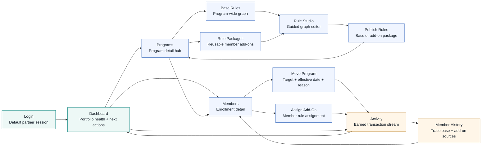

```mermaid
  flowchart LR
    login["Login\nDefault partner session"]
    dashboard["Dashboard\nPortfolio health + next actions"]
    programs["Programs\nProgram detail hub"]
    baseRules["Base Rules\nProgram-wide graph"]
    packages["Rule Packages\nReusable member add-ons"]
    studio["Rule Studio\nGuided graph editor"]
    publish["Publish Rules\nBase or add-on package"]
    members["Members\nEnrollment detail"]
    move["Move Program\nTarget + effective date + reason"]
    assign["Assign Add-On\nMember rule assignment"]
    activity["Activity\nEarned transaction stream"]
    history["Member History\nTrace base + add-on sources"]

    login --> dashboard
    dashboard --> programs
    programs --> baseRules --> studio
    programs --> packages --> studio
    studio --> publish --> programs

    dashboard --> members
    programs --> members
    members --> move --> activity
    members --> assign --> activity

    dashboard --> activity
    activity --> history --> members
    activity --> dashboard

    classDef primary fill:#edf8f6,stroke:#007f79,color:#17202a
    classDef action fill:#f0f5ff,stroke:#285eb8,color:#17202a
    classDef audit fill:#fff6e8,stroke:#b86f00,color:#17202a
    classDef neutral fill:#ffffff,stroke:#d8e0e7,color:#17202a

    class login,dashboard primary
    class programs,baseRules,packages,studio,publish,members,move,assign action
    class activity,history audit
```