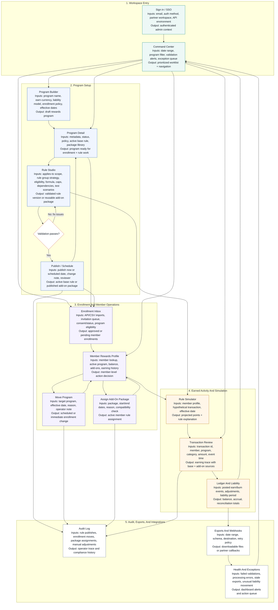

```mermaid
flowchart TB
  subgraph Entry["1. Workspace Entry"]
    SignIn["Sign in / SSO\nInputs: email, auth method, partner workspace, API environment\nOutput: authenticated admin context"]
    Home["Command Center\nInputs: date range, program filter, validation alerts, exception queue\nOutput: prioritized worklist + navigation"]
    SignIn --> Home
  end

  subgraph Setup["2. Program Setup"]
    ProgramCreate["Program Builder\nInputs: program name, earn currency, liability model, enrollment policy, effective dates\nOutput: draft rewards program"]
    ProgramDetail["Program Detail\nInputs: metadata, status, policy, active base rule, package library\nOutput: program ready for enrollment + rule work"]
    RuleStudio["Rule Studio\nInputs: applies-to scope, rule group strategy, eligibility, formula, caps, dependencies, test scenarios\nOutput: validated rule version or reusable add-on package"]
    RuleDecision{"Validation passes?"}
    Publish["Publish / Schedule\nInputs: publish now or scheduled date, change note, reviewer\nOutput: active base rule or published add-on package"]
    ProgramCreate --> ProgramDetail --> RuleStudio --> RuleDecision
    RuleDecision -- No: fix issues --> RuleStudio
    RuleDecision -- Yes --> Publish --> ProgramDetail
  end

  subgraph Enrollment["3. Enrollment And Member Operations"]
    EnrollmentInbox["Enrollment Inbox\nInputs: API/CSV imports, invitation queue, consent/status, program eligibility\nOutput: approved or pending member enrollments"]
    MemberProfile["Member Rewards Profile\nInputs: member lookup, active program, balance, add-ons, earning history\nOutput: member-level action decision"]
    MoveProgram["Move Program\nInputs: target program, effective date, reason, operator note\nOutput: scheduled or immediate enrollment change"]
    AssignPackage["Assign Add-On Package\nInputs: package, start/end dates, reason, compatibility check\nOutput: active member rule assignment"]
    EnrollmentInbox --> MemberProfile
    MemberProfile --> MoveProgram --> MemberProfile
    MemberProfile --> AssignPackage --> MemberProfile
  end

  subgraph Earn["4. Earned Activity And Simulation"]
    TransactionReview["Transaction Review\nInputs: transaction id, member, program, category, amount, event time\nOutput: earning trace with base + add-on sources"]
    Simulator["Rule Simulator\nInputs: member profile, hypothetical transaction, effective date\nOutput: projected points + rule explanation"]
    Ledger["Ledger And Liability\nInputs: posted earn/burn events, adjustments, liability period\nOutput: balance, accrual, reconciliation totals"]
    TransactionReview --> Ledger
    RuleStudio --> Simulator
    MemberProfile --> Simulator
    Simulator --> TransactionReview
  end

  subgraph Controls["5. Audit, Exports, And Integrations"]
    AuditLog["Audit Log\nInputs: rule publishes, enrollment moves, package assignments, manual adjustments\nOutput: operator trace and compliance history"]
    Exports["Exports And Webhooks\nInputs: date range, schema, destination, retry policy\nOutput: downloadable files or partner callbacks"]
    Health["Health And Exceptions\nInputs: failed validations, processing errors, stale exports, unusual liability movement\nOutput: dashboard alerts and action queue"]
    Ledger --> Exports
    Publish --> AuditLog
    MoveProgram --> AuditLog
    AssignPackage --> AuditLog
    TransactionReview --> AuditLog
    Exports --> Health --> Home
  end

  Home --> ProgramCreate
  Home --> ProgramDetail
  Home --> EnrollmentInbox
  Home --> MemberProfile
  Home --> TransactionReview
  ProgramDetail --> EnrollmentInbox
  Publish --> EnrollmentInbox
  Ledger --> Home

  classDef entry fill:#edf8f6,stroke:#007f79,color:#17202a
  classDef setup fill:#f0f5ff,stroke:#285eb8,color:#17202a
  classDef member fill:#f5f2ff,stroke:#5a54b6,color:#17202a
  classDef earn fill:#fff6e8,stroke:#b86f00,color:#17202a
  classDef audit fill:#ffffff,stroke:#697789,color:#17202a
  classDef decision fill:#fff,stroke:#c75643,color:#17202a

  class SignIn,Home entry
  class ProgramCreate,ProgramDetail,RuleStudio,Publish setup
  class EnrollmentInbox,MemberProfile,MoveProgram,AssignPackage member
  class TransactionReview,Simulator,Ledger earn
  class AuditLog,Exports,Health audit
  class RuleDecision decision
```
